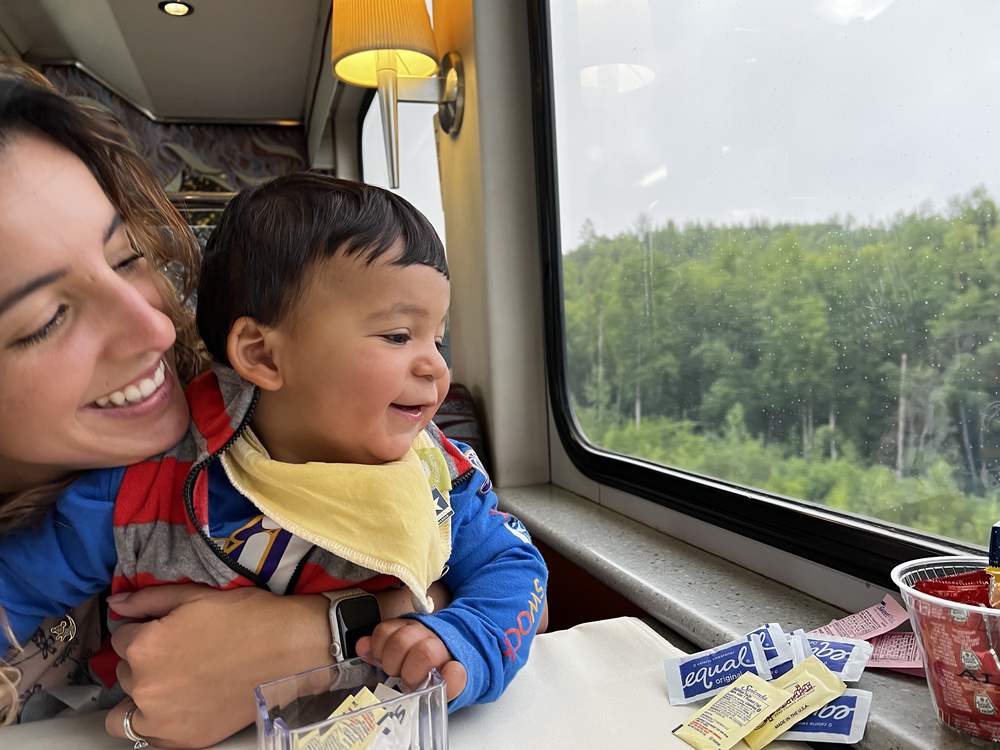
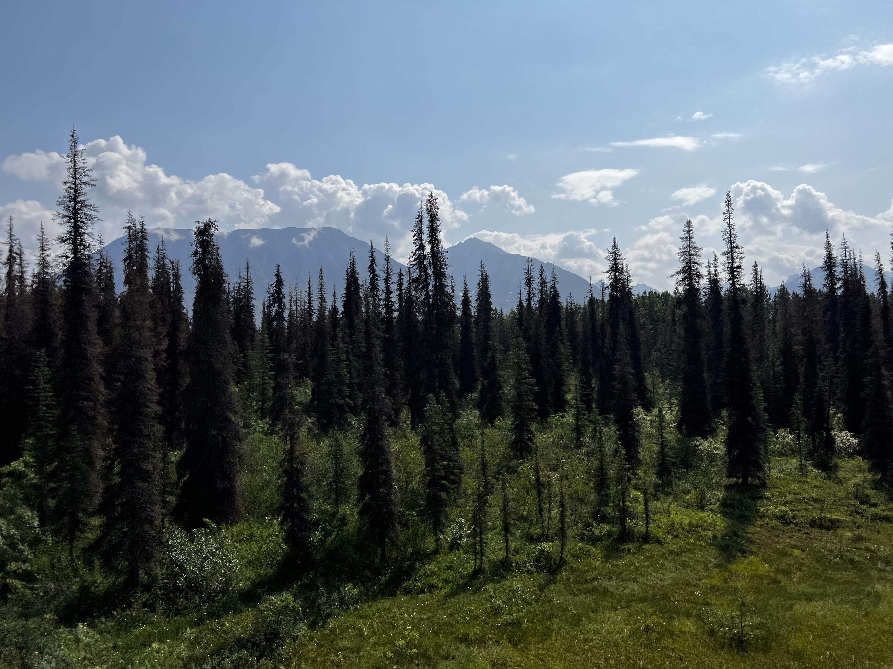
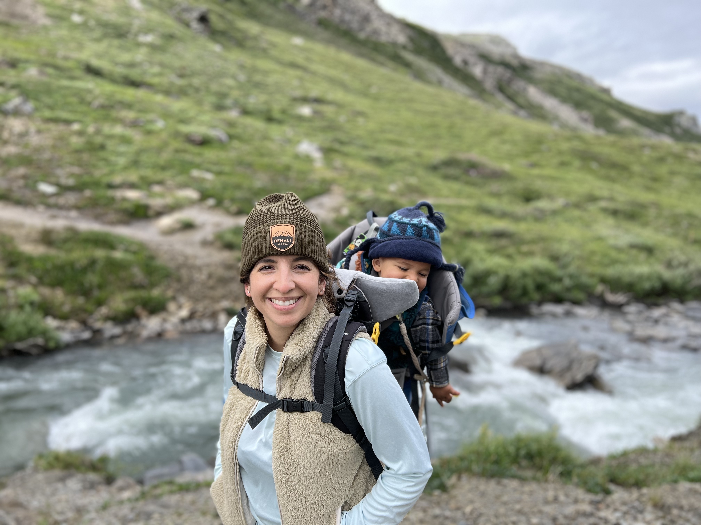
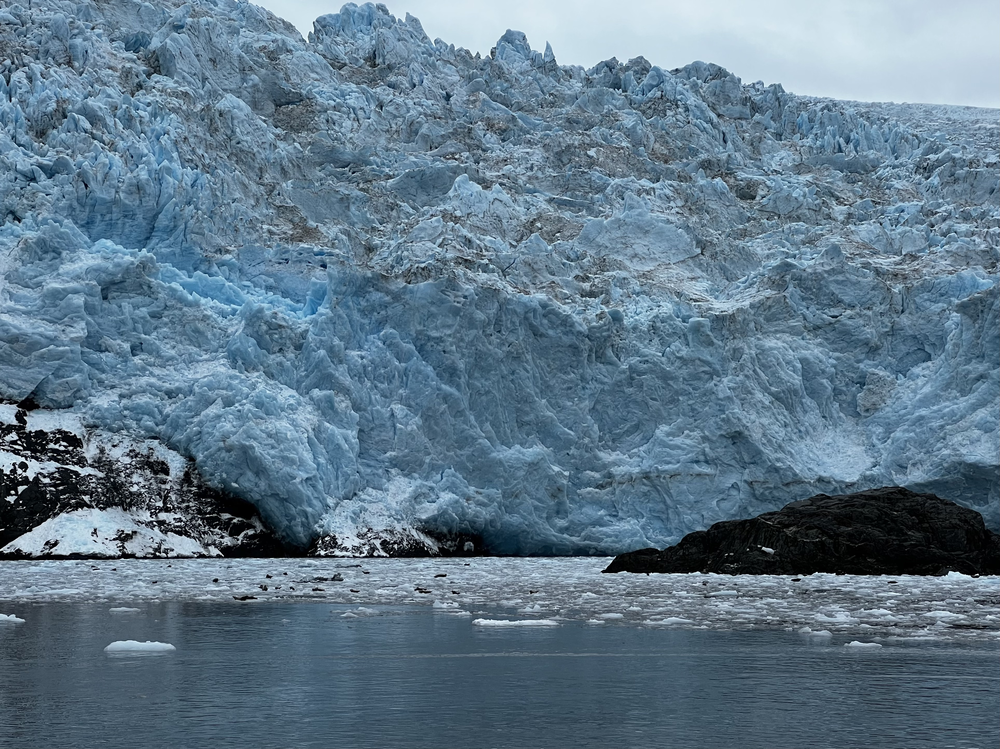
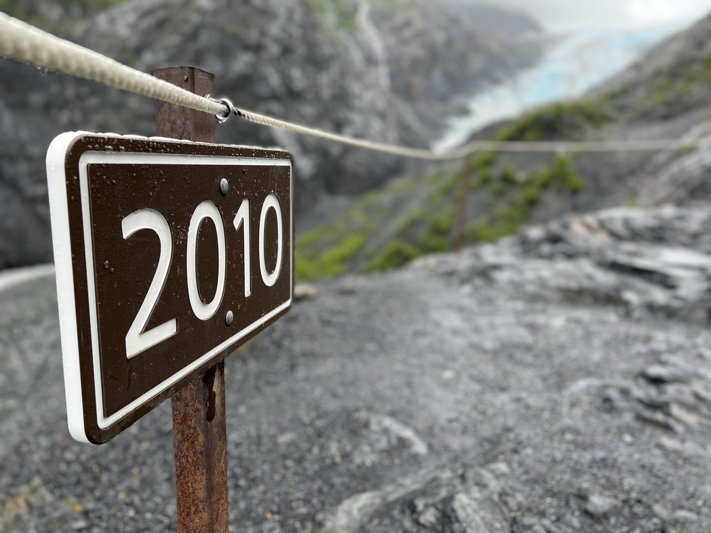

I went to Alaska for two weeks; the first to tour the beautiful state, and the second to co-lead and present in a colloquium in the Botanical Society of America BOTANY 2022 conference. You can see my talk <a href="https://www.jennaekwealor.com/talk/botany2022/" target="_blank">here</a> and more information about the colloquium <a href="https://twitter.com/Bryophyter/status/1548176508618846213?s=20&t=QoIimEjPDisrpTI7kqCPEw" target="_blank">here</a>. 

